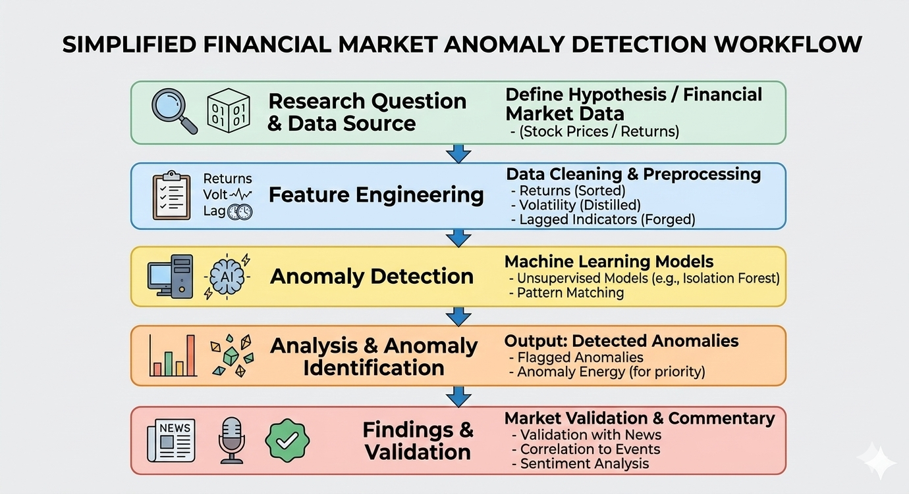
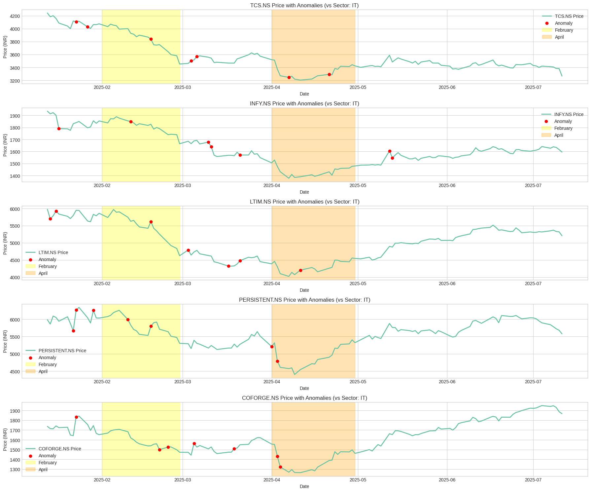

# Stock Market Anomaly Detection using Machine Learning

> Identifying abnormal price movements in Indian IT sector stocks using machine learning techniques and validating detected anomalies with real-world financial news events.

---

## Project Overview

Financial markets are often assumed to be efficient, meaning that stock prices fully reflect all available information. However, real-world markets frequently exhibit **anomalies — unusual price movements that deviate from expected behavior**.

This project applies **machine learning-based anomaly detection techniques** to identify abnormal price behavior in major Indian IT sector stocks. Detected anomalies are then interpreted using **real-world financial news and market events** to provide context.

The objective is to demonstrate how **data-driven analysis combined with market information** can help highlight unusual trading behavior that may warrant further investigation.

---

## Research Question

> *Can machine learning techniques identify abnormal stock price movements in the Indian IT sector, and can these anomalies be explained using real-world financial events?*

This project investigates whether **data-driven anomaly detection** can highlight periods of unusual market behavior that merit deeper financial analysis.

---

## Why Anomaly Detection Matters in Financial Markets

Financial markets generate large volumes of time-series data where unusual price movements may signal important underlying events.

Detecting anomalies is valuable because it can help:
- Identify **sudden market reactions** to economic or company-specific news
- Highlight **unusual trading activity** that deviates from historical patterns
- Provide early signals of **market stress or sector-wide shifts**
- Support analysts in **prioritizing events for deeper investigation**

Machine learning techniques are particularly useful for anomaly detection because they can analyze complex datasets and identify patterns that may not be immediately visible through traditional statistical analysis.

---

## Project Workflow

The analytical pipeline used in this project is illustrated below.



### Workflow Steps

1. Define research question and collect financial market data
2. Clean and preprocess historical stock price data
3. Perform feature engineering (returns, volatility indicators)
4. Apply machine learning models for anomaly detection
5. Identify abnormal price movements
6. Validate findings using financial news and market commentary

---

## Dataset

The analysis focuses on major **Indian IT sector companies**, including:
- TCS
- Infosys
- LTIMindtree
- Persistent Systems
- Coforge

Historical price data was used to compute daily returns, volatility indicators and lagged price features

These features help capture **non-typical behavior in time-series price data**.

---

## Methodology

The project follows a typical **financial anomaly detection pipeline**.

### Data Preprocessing
- Clean historical stock price data
- Handle missing observations
- Normalize time series where necessary

### Feature Engineering

Key financial indicators were created:
- daily returns
- rolling volatility
- lagged price indicators

These variables allow machine learning models to identify **statistical outliers in market behavior**.

### Anomaly Detection

Unsupervised anomaly detection methods were applied to detect observations where stock price behavior deviates significantly from historical patterns.

These anomalies represent **potentially important market events or structural changes**.

---

## Detected Stock Market Anomalies

The figure below illustrates anomaly detection results across multiple IT sector stocks.

Red markers represent **detected anomalous price movements**.



Highlighted regions represent periods where **sector-wide movements or external market factors may have influenced prices**.

---

## Real-World Market Validation

To better understand the detected anomalies, relevant financial news articles were collected and compiled.

These articles help provide context for abnormal price movements, including:

- earnings announcements
- dividend declarations
- macroeconomic developments
- sector-wide shifts in investor sentiment

The compiled news references can be found here:

**Market Evidence:**
[Market Anomalies Media Evidence](news_clippings_stock_anomalies.pdf)

This step demonstrates how **quantitative anomaly detection can be complemented with qualitative financial information**.

---

## Key Takeaways

Several insights emerged from the analysis:
- Machine learning models successfully identified **periods of abnormal price behavior** across multiple IT sector stocks.
- Some anomalies correspond to **sector-wide movements**, suggesting macroeconomic or industry-level influences.
- Other anomalies appear **stock-specific**, potentially linked to company announcements or investor sentiment.
- Combining machine learning detection with financial news analysis helps provide **better interpretation of unusual market behavior**.

---

## Limitations

- The analysis focuses on a limited number of stocks within a single sector.
- Detected anomalies represent statistical irregularities and do not necessarily imply causality.
- Financial news validation is qualitative and may not capture all market drivers influencing price movements.

---

## Technologies Used

Python
Pandas
NumPy
Scikit-learn
Matplotlib
Jupyter Notebook

---

## How to Run the Project

1. Clone the repository

```
git clone https://github.com/Vridhi-Wadhawan/stock-market-anomaly-detection.git
```

2. Install dependencies

```
pip install -r requirements.txt
```

3. Run the notebook

Open the notebook located in:

```
stock_market_anomaly_detection.ipynb
```

---

## Future Work

Potential extensions of this project include:
- expanding the analysis to additional market sectors
- applying alternative anomaly detection algorithms
- incorporating sentiment analysis from financial news sources
- integrating macroeconomic indicators into the model

---

## Disclaimer

This project is for educational and analytical purposes only and does not constitute financial advice.

---
